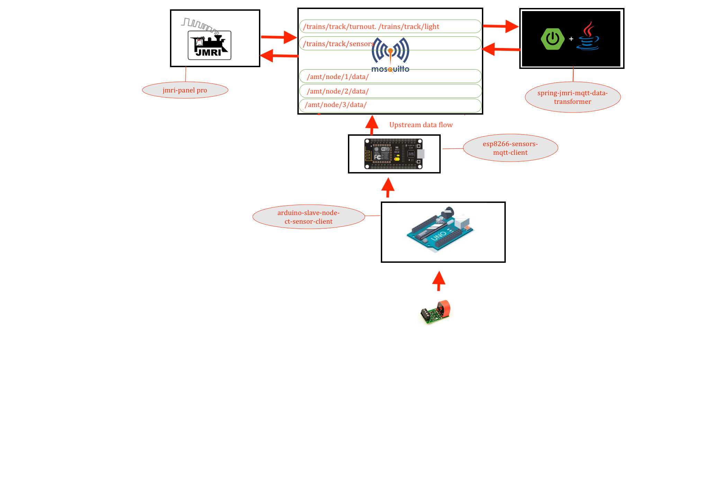

# MQTT PUBLISHER CLIENT ESP8266 FOR SENSORS 

---




## Lib installtion 

### search for "ESP8266WiFi" lib and install it before compiling 
### or install the wifi lib for esp8266 [esp8266wifi lib](https://github.com/Adarsh-Model-Trains/jmri-mqtt-spring-transformer-wireless-eco-system/raw/main/lib/ESP8266WiFi.zip)

### search for "ESP8266HTTPClient" lib and install it before compiling 
### or install the http client for esp8266 [esp8266httpclient lib](https://github.com/Adarsh-Model-Trains/jmri-mqtt-spring-transformer-wireless-eco-system/raw/main/lib/ESP8266HTTPClient.zip)


> esp will conect to mqtt via wifi network 
> wifi credentials will be configured in Config.h file 
```
#define WIFI_SSID "adarsh-model-trains" // ESP8266 do not support 5G wifi connection
#define WIFI_PASSWROD "adarsh@model@trains"
```
> mqtt configuration and credentail will be configured in Config.h file 
```
#define  MQTT_SERVER  "192.168.0.188"
#define  MQTT_USER "adarsh"
#define  MQTT_PWD "password"
```
> mqtt topics will be configured in Config.h 
```
#define JMRI_MQTT_TOPIC  "/trains/track/#"
#define JMRI_MQTT_SENSOR_TOPIC "/trains/track/sensor/"

```

> esp client id is configure in Config.h 
```
#define CLIENT_ID  "JMRI_NODE_ESP8266_PUBLISHING_1"
```

### jmri configuration 
* all sensors will start from 10000 to limit 

## To Open Two arduino sperate ide on mac 
* $ open -n -a Arduino
* -n = open new instance even when one is already running
* -a xxx = open application xxx


### Connection details 

```
conect the gnd from arduino to the -ve line of the breadboard 
take nodemcu/esp8266 connect the gnd/-ve from breadboard to the gnd of the nodemcu/esp8266
take the tx pin of the nodemcu/esp8266 and connect to the rx pin of the arduino 
take the rx pin of the nodemcu/esp8266 and connect to the tx pin of the arduino 

```


