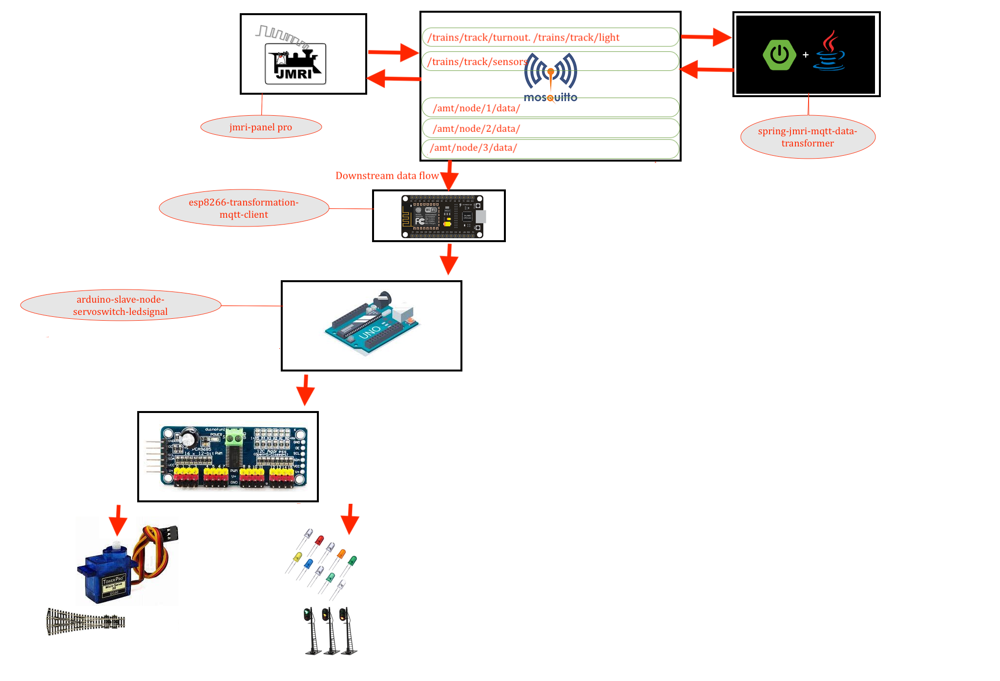
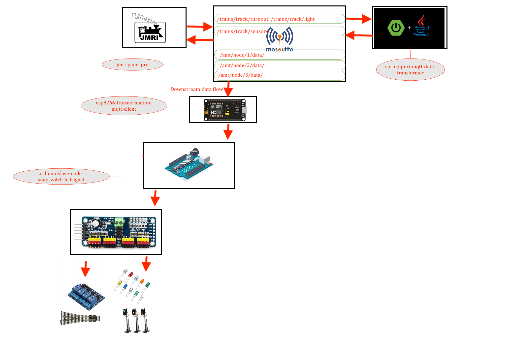

# MQTT ESP8266 

---





## Lib installtion 

### search for "PubSubClient" lib and install it before compiling 
### or install this lib for location [PubSubClient lib ](https://github.com/Adarsh-Model-Trains/jmri-mqtt-spring-transformer-wireless-eco-system/raw/main/lib/pubsubclient.zip)

### search for "ESP8266WiFi" lib and install it before compiling 
### or install the wifi lib for esp8266 [esp8266wifi lib](https://github.com/Adarsh-Model-Trains/jmri-mqtt-spring-transformer-wireless-eco-system/raw/main/lib/ESP8266WiFi.zip)


> esp will conect to mqtt via wifi network 
> wifi credentials will be configured in Config.h file 
```
#define WIFI_SSID "adarsh-model-trains" // ESP8266 do not support 5G wifi connection
#define WIFI_PASSWROD "adarsh@model@trains"
```
> mqtt configuration and credentail will be configured in Config.h file 
```
#define  MQTT_SERVER  "192.168.0.188"
#define  MQTT_USER "adarsh"
#define  MQTT_PWD "password"
```
> mqtt topics will be configured in Config.h 
```
// change the node "number/name"  based on the node default is 1 in this 
#define JMRI_MQTT_TOPIC "/amt/node/1/#"
```

> esp client id is configure in Config.h 
```
// change the node "number/name"  based on the node
#define CLIENT_ID "JMRI_SUBSCRIBER_NODE_ESP8266_1"
```

### jmri configuration 
* all sensors will start from 10000 to limit 
* all the light are started with 10000 onwards to 9999 address address on jmri
* all the 2 led signal are started with 20000 onwards to 29999 address on jmri
* all the 3 led signal are started with 30000 onwards to 39999 address on jmri
* all the servo turnout are started with 40000 onwards to 49999 address on jmri
* all the snap turnout are started with 50000 onwards to 59999 address on jmri


## To Open Two arduino sperate ide on mac 
* $ open -n -a Arduino
* -n = open new instance even when one is already running
* -a xxx = open application xxx


### Connection details 

```
conect the gnd from arduino to the -ve line of the breadboard 
take nodemcu/esp8266 connect the gnd/-ve from breadboard to the gnd of the nodemcu/esp8266
take the tx pin of the nodemcu/esp8266 and connect to the rx pin of the arduino 
take the rx pin of the nodemcu/esp8266 and connect to the tx pin of the arduino 

```


