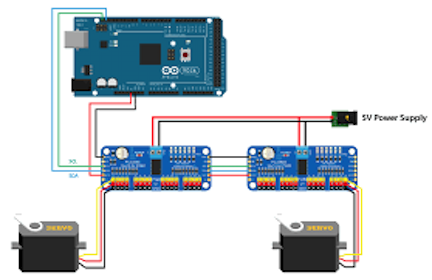

# Arduino Uno/mega client for Servo Turnout and led signals 

---


> arduino client will connect to the esp via seraila Rx/Tx pins 
> gnd will be common in both the devices 


### Configuration of the number of boards based on the turnout light and 2 and 3 led signals 
> msut match in node configuraiton in transformer 
```
#define NO_OF_TURNOUT_BOARDS 3
#define NO_OF_LIGHT_BOARDS 3
#define NO_OF_TOTAL_BOARDS 6
```

### other configuration 
``` 
#define BROAD_RATE 115200
#define DELAY_TIME 200
const bool slowMove = true;
```

### Configuration of the open and close range for the servo moter 
> use the callibration application "servo-turnout-calibration" for the finding the open and close range 
> for the each servo and feed in the array board wise for each pin 

```
int turnoutRange[][TOTAL_BOARD_PIN][RANGE_TYPE] = {
  {  // BOARD 0 
    {OPEN_RANGE, CLOSE_RANGE},  // PIN 0
    {OPEN_RANGE, CLOSE_RANGE}   // PIN 1
    ........
   },
   {  // BOARD 1 
    {OPEN_RANGE, CLOSE_RANGE},  // PIN 0
    {OPEN_RANGE, CLOSE_RANGE}   // PIN 1
    ........
   },
   
   ........
   ........
   
   {  // BOARD N 
    {OPEN_RANGE, CLOSE_RANGE},  // PIN 0
    {OPEN_RANGE, CLOSE_RANGE}   // PIN 1
    ........
   }
};
```


## To Open Two arduino sperate ide on mac 
* $ open -n -a Arduino
* -n = open new instance even when one is already running
* -a xxx = open application xxx

### Connection details 
```
conect the gnd from arduino to the -ve line of the breadboard 
take nodemcu/esp8266 connect the gnd/-ve from breadboard to the gnd of the nodemcu/esp8266
take the tx pin of the nodemcu/esp8266 and connect to the rx pin of the arduino 
take the rx pin of the nodemcu/esp8266 and connect to the tx pin of the arduino 

```



