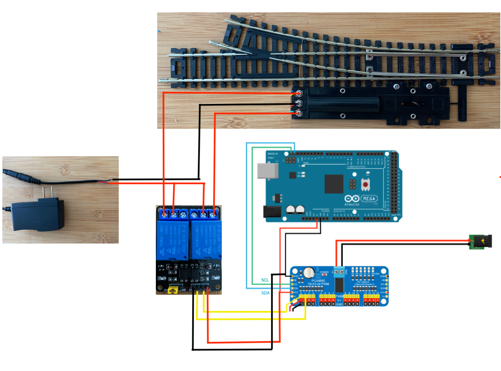

# ARDUINO & ESP8266 MQTT BASED SNAP TURNOUT IMPLEMENATIONS FOR TURNOUTS & SIGNALING SYSTEM

--- 

## Code Download 
### [mqtt-snapturnout-signals](https://github.com/Adarsh-Model-Trains/jmri-mqtt-spring-transformer-wireless-eco-system/raw/production/ESP-ARDUINO-SOLUTIONS/zip/mqtt-snapturnout-signals.zip)

## To Open Two arduino sperate ide on mac 
* $ open -n -a Arduino
* -n = open new instance even when one is already running
* -a xxx = open application xxx


### Connection details for esp and arduino 
```
The Arduino Uno has three additional serial ports: 
Serial  on pins 0 (RX) and 1 (TX), 

The Arduino Mega has three additional serial ports: 
Serial  on pins 0 (RX) and 1 (TX), // we will use default alway

conect the gnd from arduino to the -ve line of the breadboard 
take nodemcu/esp8266 connect the gnd/-ve from breadboard to the gnd of the nodemcu/esp8266
take the tx pin of the nodemcu/esp8266 and connect to the rx pin of the arduino 
take the rx pin of the nodemcu/esp8266 and connect to the tx pin of the arduino 

```


