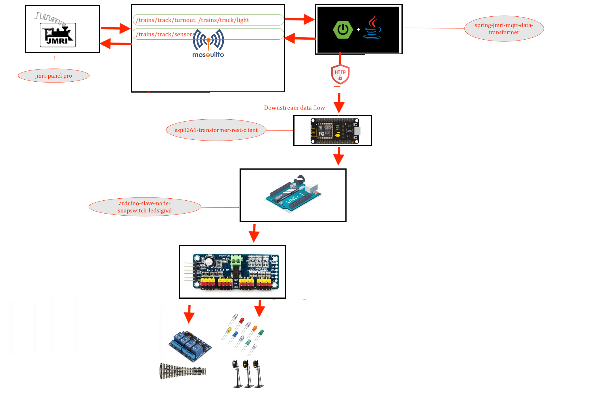

# ESP8266 SPRING TRANSFORMER REST CLIENT 

---





## Lib installtion 

### search for "ESP8266HTTPClient" lib and install it before compiling 
### or install this lib for esp8266 [esp8266httpclient lib](https://github.com/Adarsh-Model-Trains/jmri-mqtt-spring-transformer-wireless-eco-system/raw/main/lib/ESP8266HTTPClient.zip)


### search for "ESP8266WiFi" lib and install it before compiling 
### or install the wifi lib for esp8266 [esp8266wifi lib](https://github.com/Adarsh-Model-Trains/jmri-mqtt-spring-transformer-wireless-eco-system/raw/main/lib/ESP8266WiFi.zip)


> esp will conect to spring transformation application via wifi network 
> wifi credentials will be configured in Config.h file 
```
#define WIFI_SSID "adarsh-model-trains"
#define WIFI_PASSWROD "adarsh@model@trains"

```

> spring transformation rest service url configured in Config.h file 
* "http://localhost:8090/amt/node/<NODE_ID>";
```
const char* SERVER_URL = "http://192.168.0.188:8090/amt/node/1";
```

## Lib installtion 

### search for "PubSubClient" lib and install it before compiling 
### or install this lib for location [PubSubClient lib ](https://github.com/adarshkumarsingh83/jmri-cmri/raw/main/DOCUMENTS/JMRI-MOSQUITTO-MQTT/lib/pubsubclient.zip)

### jmri configuration 
* all sensors will start from 10000 to limit 
* all the light are started with 10000 onwards to 9999 address address on jmri
* all the 2 led signal are started with 20000 onwards to 29999 address on jmri
* all the 3 led signal are started with 30000 onwards to 39999 address on jmri
* all the servo turnout are started with 40000 onwards to 49999 address on jmri
* all the snap turnout are started with 50000 onwards to 59999 address on jmri


## To Open Two arduino sperate ide on mac 
* $ open -n -a Arduino
* -n = open new instance even when one is already running
* -a xxx = open application xxx


### Connection details 
```
conect the gnd from arduino to the -ve line of the breadboard 
take nodemcu/esp8266 connect the gnd/-ve from breadboard to the gnd of the nodemcu/esp8266
take the tx pin of the nodemcu/esp8266 and connect to the rx pin of the arduino 
take the rx pin of the nodemcu/esp8266 and connect to the tx pin of the arduino 

```


