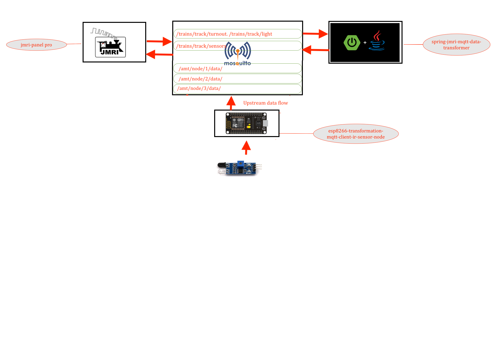

# ESP8266 MQTT PUBLISHER CLIENT FOR IR SENSORS 

---




## Lib installtion 

### search for "PubSubClient" lib and install it before compiling 
### or install this lib for location [PubSubClient lib ](https://github.com/Adarsh-Model-Trains/jmri-mqtt-spring-transformer-wireless-eco-system/raw/main/lib/pubsubclient.zip)

### search for "ESP8266WiFi" lib and install it before compiling 
### or install the wifi lib for esp8266 [esp8266wifi lib](https://github.com/Adarsh-Model-Trains/jmri-mqtt-spring-transformer-wireless-eco-system/raw/main/lib/ESP8266WiFi.zip)

## Code Download 
### [esp8266-mqtt-ir-sensor](https://github.com/Adarsh-Model-Trains/jmri-mqtt-spring-transformer-wireless-eco-system/raw/production/ESP-SOLUTIONS/eesp8266-mqtt-ir-sensor.zip)


> arduino client will connect to the esp via seraila Rx/Tx pins 
> gnd will be common in both the devices 


### Configuration of the number of sensors 
> msut match in the jmri sensors configuration  
```
#define JMRI_SENSOR_START_ADDRESS 10000
#define BROAD_RATE 115200
#define DELAY_TIME 5000
#define NO_OF_BLOCKS 3
```

## IR Sensors pins configuration for arduino in Config.h
```
// IR SENSORS PIN CONFIGURATION 
  const int sensorPin[NO_OF_BLOCKS][PINS] = {
  {BLOCK_1_END_PIN, BLOCK_1_START_PIN },
  {BLOCK_2_END_PIN, BLOCK_2_START_PIN },
  ..........
  {BLOCK_N_END_PIN, BLOCK_N_START_PIN }
  };
```

## To Open Two arduino sperate ide on mac 
* $ open -n -a Arduino
* -n = open new instance even when one is already running
* -a xxx = open application xxx
