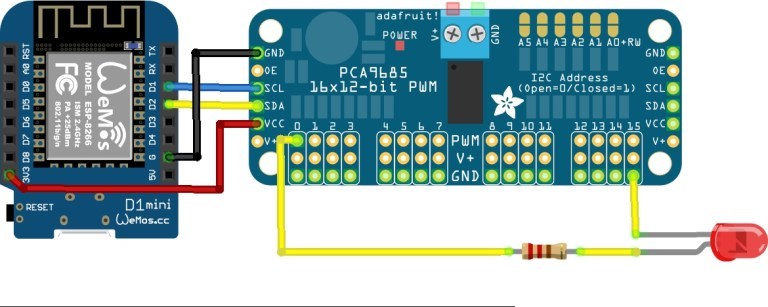
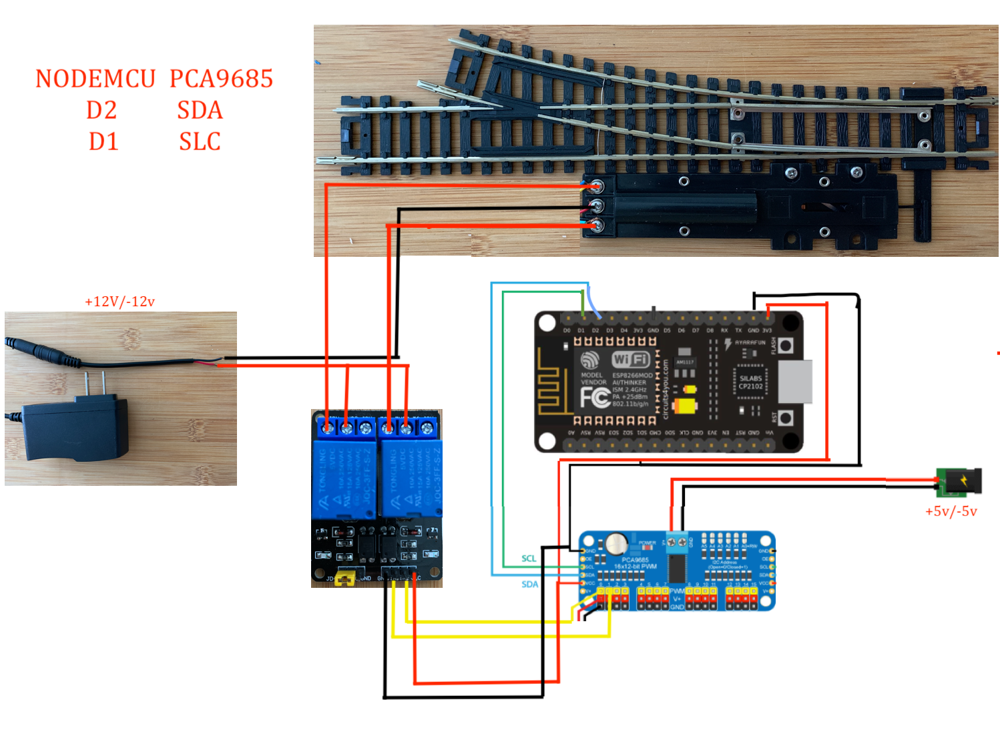

# Esp8266 mqtt client for Servo and Snap turnout switch and led signals 

---


## Lib installtion 
### search for "PubSubClient" lib and install it before compiling 
### or install this lib for location [PubSubClient lib ](https://github.com/Adarsh-Model-Trains/jmri-mqtt-spring-transformer-wireless-eco-system/raw/main/lib/pubsubclient.zip)

### search for "ESP8266WiFi" lib and install it before compiling 
### or install the wifi lib for esp8266 [esp8266wifi lib](https://github.com/Adarsh-Model-Trains/jmri-mqtt-spring-transformer-wireless-eco-system/raw/main/lib/ESP8266WiFi.zip)


## Code Download 
### [esp8266-mqtt-servo-snap-turnout-signals](https://github.com/Adarsh-Model-Trains/jmri-mqtt-spring-transformer-wireless-eco-system/raw/production/ESP-SOLUTIONS/zip/eesp8266-mqtt-servo-snap-turnout-signals.zip)

> esp client will connect to pca9685 
> via scl which is D1 on esp and sda which D2 on Esp 

> esp will conect to mqtt via wifi network 
> wifi credentials will be configured in Config.h file 
```
// ESP8266 do not support 5G wifi connection
#define WIFI_SSID "adarsh-model-trains"
#define WIFI_PASSWROD "adarsh@model@trains"
```
> mqtt configuration and credentail will be configured in Config.h file 
```
#define MQTT_SERVER "192.168.0.188"
#define MQTT_USERNAME "adarsh"
#define MQTT_PASSORD "password"
```

> esp client id is configure in Config.h 
```
#define CLIENT_ID  "JMRI_NODE_ESP8266_PUBLISHING_1"

```

### mqtt topic to listen 
```
// change the node "number/name"  based on the node default is 1 in this
#define MQTT_TOPIC "/amt/node/1/#"
```

### Configuration of the number of boards based on the turnout light and 2 and 3 led signals 
> msut match in node configuraiton in transformer 
```
#define NO_OF_SERVO_TURNOUT_BOARDS 1
#define NO_OF_SNAP_TURNOUT_BOARDS 1
#define NO_OF_LIGHT_BOARDS 3
#define NO_OF_TOTAL_BOARDS 5
```


### Configuration of the open and close range for the servo moter 
> use the callibration application "servo-turnout-calibration" for the finding the open and close range 
> for the each servo and feed in the array board wise for each pin 

```
int turnoutRange[][TOTAL_BOARD_PIN][RANGE_TYPE] = {
  {  // BOARD 0 
    {OPEN_RANGE, CLOSE_RANGE},  // PIN 0
    {OPEN_RANGE, CLOSE_RANGE}   // PIN 1
    ........
   },
   {  // BOARD 1 
    {OPEN_RANGE, CLOSE_RANGE},  // PIN 0
    {OPEN_RANGE, CLOSE_RANGE}   // PIN 1
    ........
   },
   
   ........
   ........
   
   {  // BOARD N 
    {OPEN_RANGE, CLOSE_RANGE},  // PIN 0
    {OPEN_RANGE, CLOSE_RANGE}   // PIN 1
    ........
   }
};
```


## To Open Two arduino sperate ide on mac 
* $ open -n -a Arduino
* -n = open new instance even when one is already running
* -a xxx = open application xxx

### Connection details 
```
esp rest client will connect to pca9685 
via scl which is D1 on esp and sda which D2 on Esp 

```







