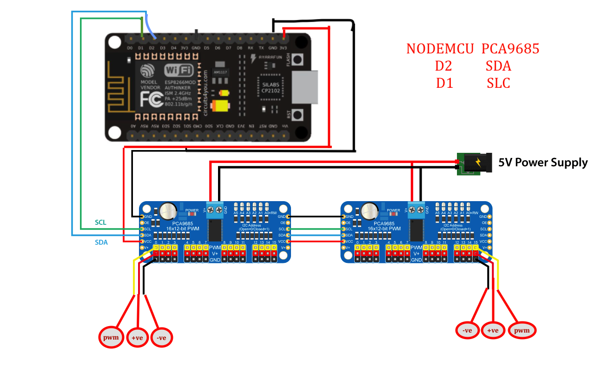

# Esp8266 Rest client for Snapeswitch and led signals 

---


> esp rest client will connect to pca9685 
> via scl which is D1 on esp and sda which D2 on Esp 


## Lib installtion 

### search for "PubSubClient" lib and install it before compiling 
### or install this lib for location [PubSubClient lib ](https://github.com/Adarsh-Model-Trains/jmri-mqtt-spring-transformer-wireless-eco-system/raw/main/lib/pubsubclient.zip)

### search for "ESP8266WiFi" lib and install it before compiling 
### or install the wifi lib for esp8266 [esp8266wifi lib](https://github.com/Adarsh-Model-Trains/jmri-mqtt-spring-transformer-wireless-eco-system/raw/main/lib/ESP8266WiFi.zip)


### Configuration of the number of boards based on the turnout light and 2 and 3 led signals 
> msut match in node configuraiton in transformer 
```
#define NO_OF_TURNOUT_BOARDS 3
#define NO_OF_LIGHT_BOARDS 3
#define NO_OF_TOTAL_BOARDS 6
```

## To Open Two arduino sperate ide on mac 
* $ open -n -a Arduino
* -n = open new instance even when one is already running
* -a xxx = open application xxx

### Connection details 
```
esp rest client will connect to pca9685 
via scl which is D1 on esp and sda which D2 on Esp 

```




