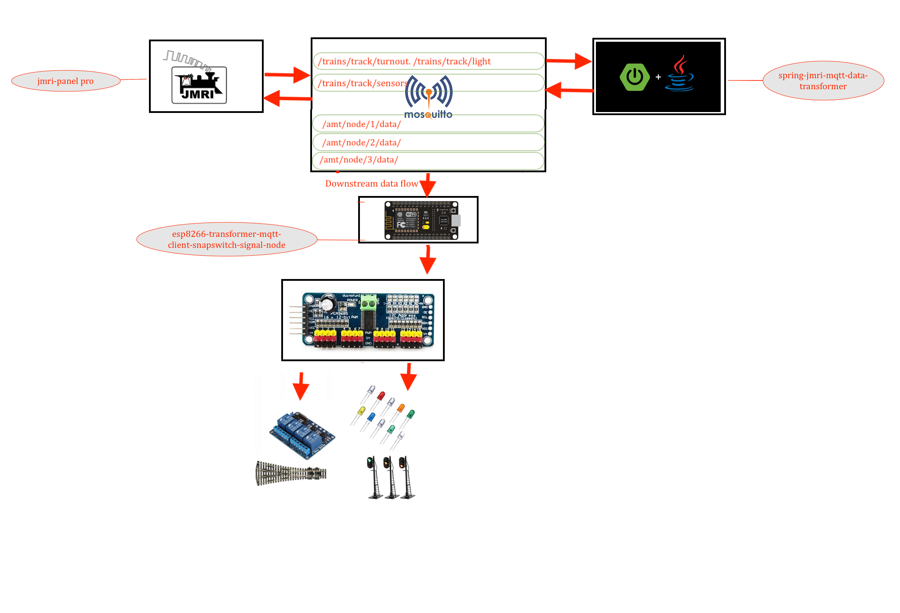

# Esp8266 Rest client for Snapeswitch and led signals 

---



> esp rest client will connect to pca9685 
> via scl which is D1 on esp and sda which D2 on Esp 


## Lib installtion 

### search for "ESP8266WiFi" lib and install it before compiling 
### or install the wifi lib for esp8266 [esp8266wifi lib](https://github.com/Adarsh-Model-Trains/jmri-mqtt-spring-transformer-wireless-eco-system/raw/main/lib/ESP8266WiFi.zip)


## Code Download 
### [esp8266-mqtt-snapturnout-signals](https://github.com/Adarsh-Model-Trains/jmri-mqtt-spring-transformer-wireless-eco-system/raw/v1.production/ESP-SOLUTIONS/zip/esp8266-mqtt-snapturnout-signals.zip)

### esp will conect to mqtt via wifi network 
> wifi credentials will be configured in Config.h file 
```
#define WIFI_SSID "adarsh-model-trains" // ESP8266 do not support 5G wifi connection
#define WIFI_PASSWROD "adarsh@model@trains"
```
> mqtt configuration and credentail will be configured in Config.h file 
```
#define  MQTT_SERVER  "192.168.0.188"
#define  MQTT_USER "adarsh"
#define  MQTT_PWD "password"
```
> mqtt topics will be configured in Config.h 
```
// change the node "number/name"  based on the node default is 1 in this 
#define JMRI_MQTT_TOPIC "/amt/node/1/#"
```

> esp client id is configure in Config.h 
```
// change the node "number/name"  based on the node
#define CLIENT_ID "JMRI_SUBSCRIBER_NODE_ESP8266_1"
```

### Configuration of the number of boards based on the turnout light and 2 and 3 led signals 
> msut match in node configuraiton in transformer 
```
#define NO_OF_TURNOUT_BOARDS 3
#define NO_OF_LIGHT_BOARDS 3
#define NO_OF_TOTAL_BOARDS 6
```

## To Open Two arduino sperate ide on mac 
* $ open -n -a Arduino
* -n = open new instance even when one is already running
* -a xxx = open application xxx

### Connection details 
```
esp rest client will connect to pca9685 
via scl which is D1 on esp and sda which D2 on Esp 

```


