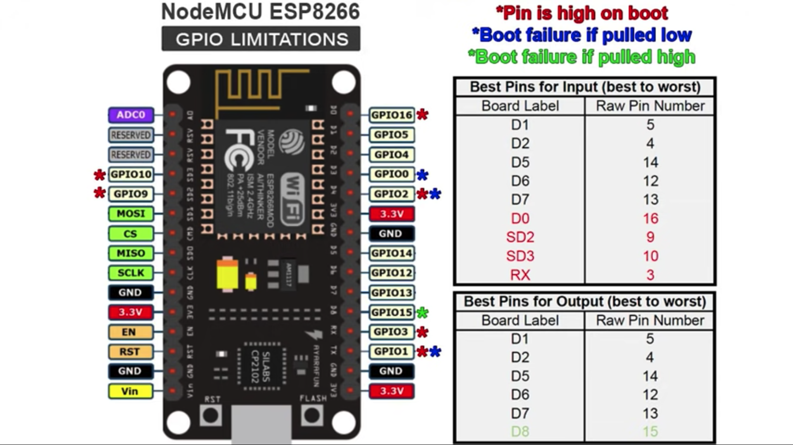

# ESP8266 SPRING TRANSFORMER REST CLIENT PUBLISHER IR SENSORS

---





## Lib installtion 

### search for "ESP8266HTTPClient" lib and install it before compiling 
### or install this lib for esp8266 [esp8266httpclient lib](https://github.com/Adarsh-Model-Trains/jmri-mqtt-spring-transformer-wireless-eco-system/raw/main/lib/ESP8266HTTPClient.zip)

### search for "ESP8266WiFi" lib and install it before compiling 
### or install the wifi lib for esp8266 [esp8266wifi lib](https://github.com/Adarsh-Model-Trains/jmri-mqtt-spring-transformer-wireless-eco-system/raw/main/lib/ESP8266WiFi.zip)

## Code Download 
### [esp8266-rest-ir-sensor](https://github.com/Adarsh-Model-Trains/jmri-mqtt-spring-transformer-wireless-eco-system/raw/v1.production/ESP-SOLUTIONS/zip/eesp8266-rest-ir-sensor.zip)


> esp will conect to spring transformation application via wifi network 
> wifi credentials will be configured in Config.h file 
```
#define WIFI_SSID "adarsh-model-trains"
#define WIFI_PASSWROD "adarsh@model@trains"
```

> spring transformation rest service url configured in Config.h file 
* "http://localhost:8090/amt/node/<NODE_ID>";
```
#define SERVER_URL = "http://192.168.0.188:8090/amt/node/1";
```

## IR Sensors pins configuration for arduino in Config.h
```
// IR SENSORS PIN CONFIGURATION 
  const int sensorPin[NO_OF_BLOCKS][PINS] = {
  {BLOCK_1_END_PIN, BLOCK_1_START_PIN },
  {BLOCK_2_END_PIN, BLOCK_2_START_PIN },
  ..........
  {BLOCK_N_END_PIN, BLOCK_N_START_PIN }
  };
```


### TO POST THE SENSOR INFO TO  MQTT  VIA END POINTS 
> curl --header "Content-Type: application/json" --request POST --data '{"topic":"xyz","data":"xyz"}' http://localhost:8090/amt/node/[nodeId]
* curl --header "Content-Type: application/json" \
  --request POST \
  --data '{"topic":"/trains/track/sensor/1","data":"INACTIVE"}' \
  http://localhost:8090/amt/node/1
  
* curl --header "Content-Type: application/json" \
  --request POST \
  --data '{"topic":"/trains/track/sensor/1","data":"ACTIVE"}' \
  http://localhost:8090/amt/node/1


### jmri configuration 
* all sensors will start from 10000 to limit 


## To Open Two arduino sperate ide on mac 
* $ open -n -a Arduino
* -n = open new instance even when one is already running
* -a xxx = open application xxx

