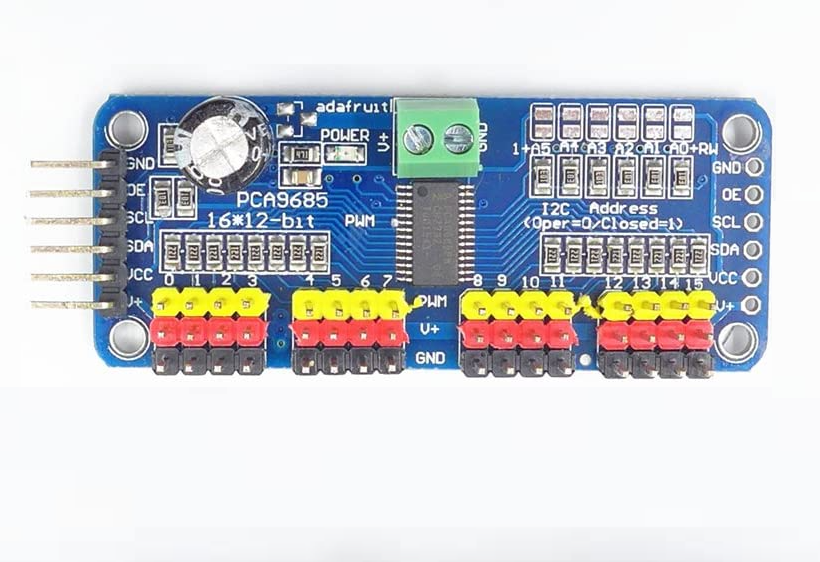
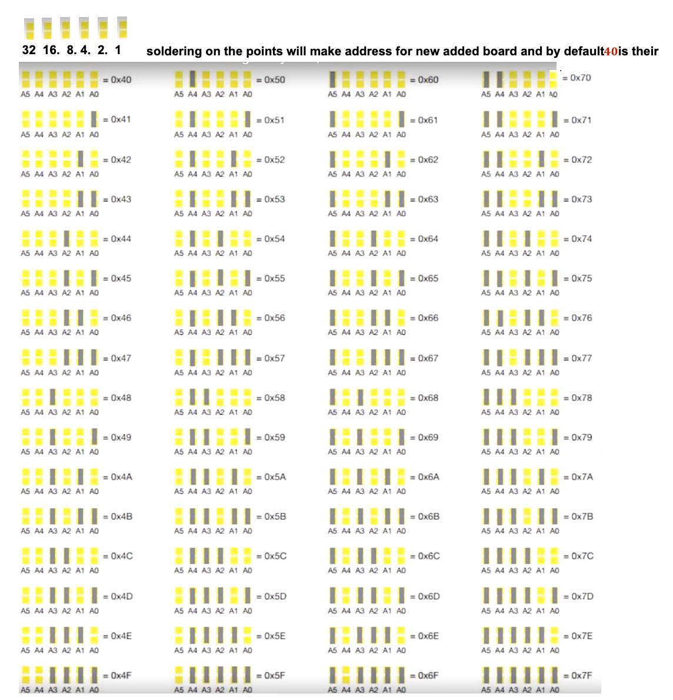
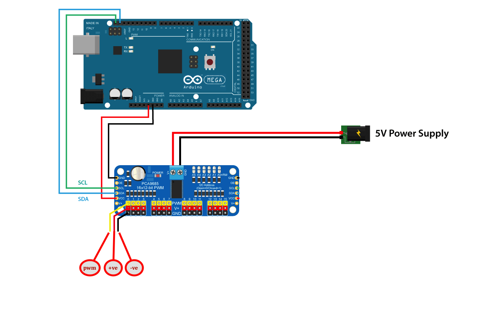
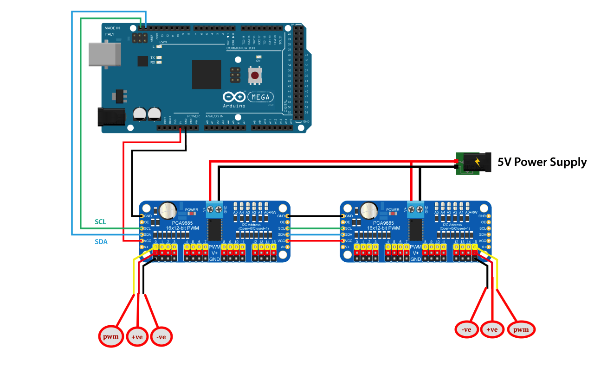
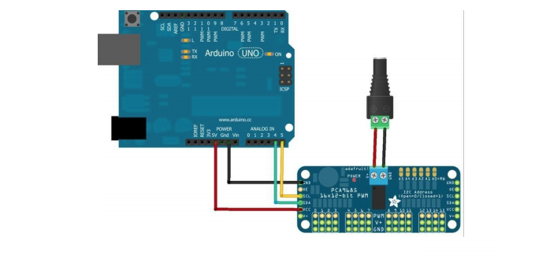
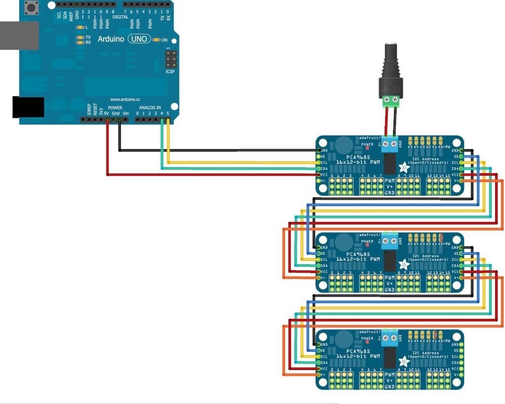

# PCA9685

----



```
pca9685 is 16 pin pwm based board 
max we can connect 64 Pca9685 together in chain which will give extra 1024 pins for operations
```

## Address Configuration 

```
we have to soilder the address pins 
we have 

32 16 8 4 2 1 

where we have to solder and obtaine the new address 
by defautl its like 

0 0 0 0 0 0 

```


## Board Configurattion style 1





## Board Configurattion style 2






