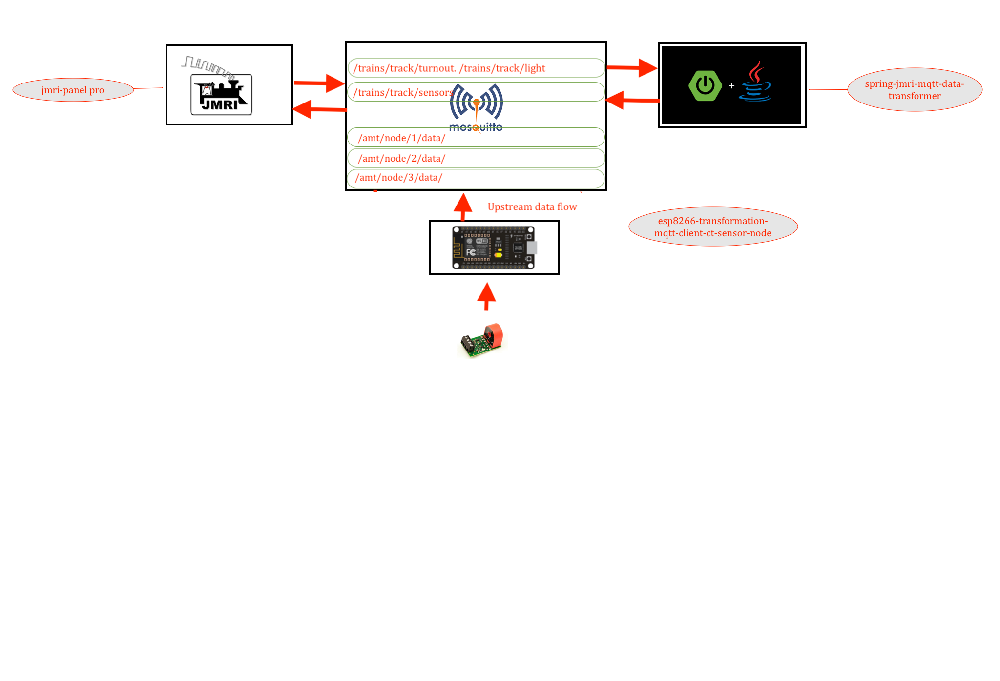

# ESP8266 MQTT PUBLISHER CLIENT FOR CT SENSORS 

---



> esp will conect to mqtt via wifi network 
> wifi credentials will be configured in Config.h file 
```
const char* ssid = "adarsh_radha_2G"; // ESP8266 do not support 5G wifi connection
const char* wifi_password = "*******";
```
> mqtt configuration and credentail will be configured in Config.h file 
```
const char* mqtt_server = "192.168.0.188"; 
const char* mqtt_username = "adarsh";
const char* mqtt_password = "password";
```
> mqtt topics will be configured in Config.h 
```
const String JMRI_MQTT_SENSOR_TOPIC = "/trains/track/sensor/";

```

> esp client id is configure in Config.h 
```
const char* CLIENT_ID = "JMRI_NODE_ESP8266_PUBLISHING_1";

```

## Lib installtion 

### search for "PubSubClient" lib and install it before compiling 
### or install this lib for location [PubSubClient lib ](https://github.com/adarshkumarsingh83/jmri-cmri/raw/main/DOCUMENTS/JMRI-MOSQUITTO-MQTT/lib/pubsubclient.zip)

### jmri configuration 
* all sensors will start from 10000 to limit 

## To Open Two arduino sperate ide on mac 
* $ open -n -a Arduino
* -n = open new instance even when one is already running
* -a xxx = open application xxx

