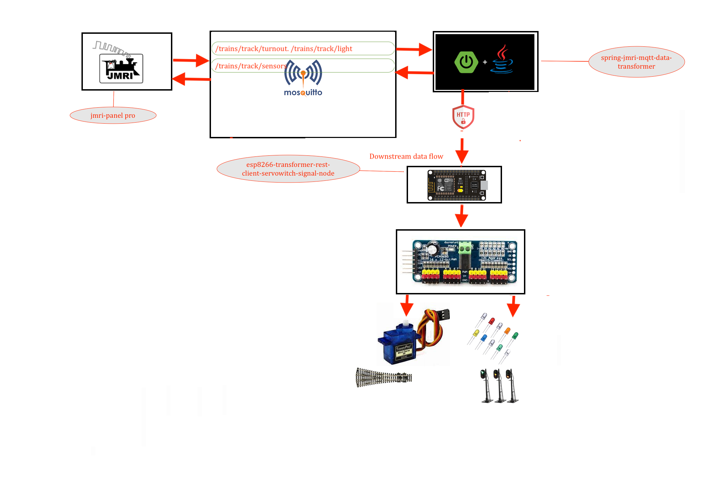

# Esp8266 Rest client for Servo turnout switch and led signals 

---



> esp rest client will connect to pca9685 
> via scl which is D1 on esp and sda which D2 on Esp 


### Configuration of the number of boards based on the turnout light and 2 and 3 led signals 
> msut match in node configuraiton in transformer 
```
#define NO_OF_TURNOUT_BOARDS 3
#define NO_OF_LIGHT_BOARDS 3
#define NO_OF_TOTAL_BOARDS 6
```


### Configuration of the open and close range for the servo moter 
> use the callibration application "servo-turnout-calibration" for the finding the open and close range 
> for the each servo and feed in the array board wise for each pin 

```
int turnoutRange[][TOTAL_BOARD_PIN][RANGE_TYPE] = {
  {  // BOARD 0 
    {OPEN_RANGE, CLOSE_RANGE},  // PIN 0
    {OPEN_RANGE, CLOSE_RANGE}   // PIN 1
    ........
   },
   {  // BOARD 1 
    {OPEN_RANGE, CLOSE_RANGE},  // PIN 0
    {OPEN_RANGE, CLOSE_RANGE}   // PIN 1
    ........
   },
   
   ........
   ........
   
   {  // BOARD N 
    {OPEN_RANGE, CLOSE_RANGE},  // PIN 0
    {OPEN_RANGE, CLOSE_RANGE}   // PIN 1
    ........
   }
};
```


## To Open Two arduino sperate ide on mac 
* $ open -n -a Arduino
* -n = open new instance even when one is already running
* -a xxx = open application xxx

### Connection details 
```
esp rest client will connect to pca9685 
via scl which is D1 on esp and sda which D2 on Esp 

```


