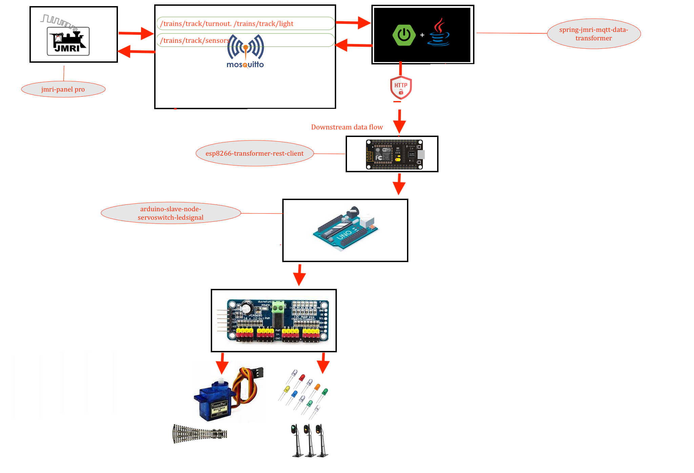
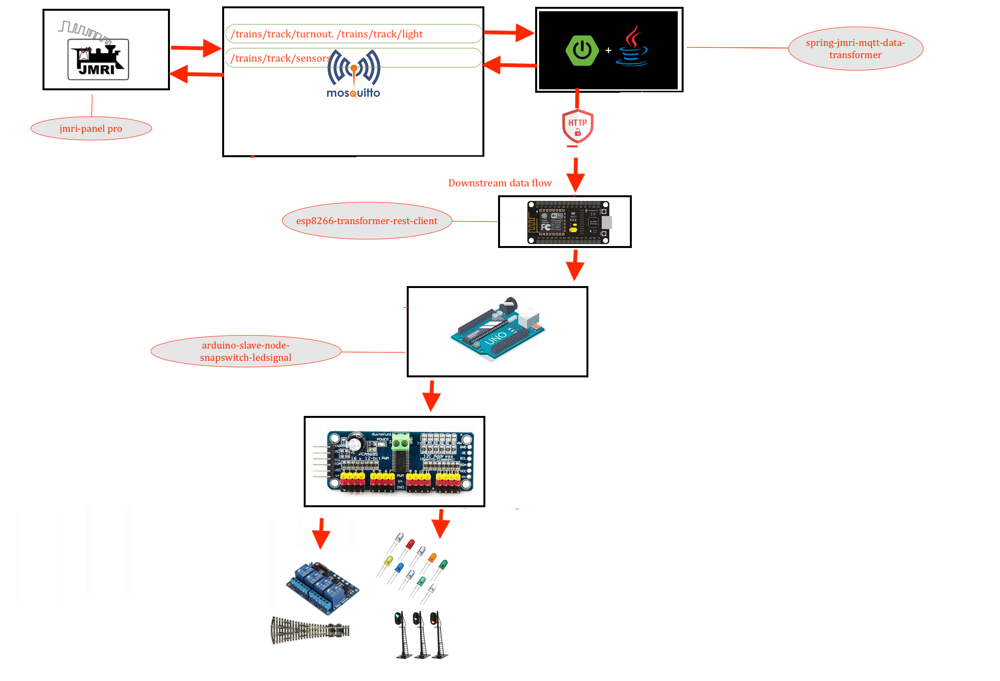
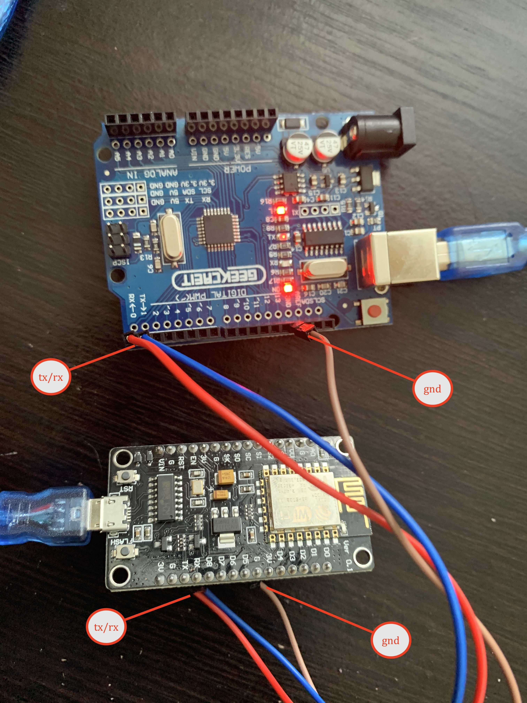

# ESP8266 SPRING TRANSFORMER REST CLIENT 

---




> esp will conect to spring transformation application via wifi network 
> wifi credentials will be configured in Config.h file 
```
const char* ssid = "adarsh_radha_2G"; // ESP8266 do not support 5G wifi connection
const char* wifi_password = "*******";

```

> spring transformation rest service url configured in Config.h file 
* "http://localhost:8090/amt/node/<NODE_ID>";
```
const char* SERVER_URL = "http://192.168.0.188:8090/amt/node/1";
```

## Lib installtion 

### search for "PubSubClient" lib and install it before compiling 
### or install this lib for location [PubSubClient lib ](https://github.com/adarshkumarsingh83/jmri-cmri/raw/main/DOCUMENTS/JMRI-MOSQUITTO-MQTT/lib/pubsubclient.zip)

### jmri configuration 
* all sensors will start from 1 to limit 
* all the light are started with 1000 onwards to 9999 address on jmri
* all the turnout are started with 10000 onwards to 19999 address on jmri
* all the 2 led signal are started with 20000 onwards to 29999 
* all the 3 led signal are started with 30000 onwards to address on jmri support


## To Open Two arduino sperate ide on mac 
* $ open -n -a Arduino
* -n = open new instance even when one is already running
* -a xxx = open application xxx


### Connection details 
```
conect the gnd from arduino to the -ve line of the breadboard 
take nodemcu/esp8266 connect the gnd/-ve from breadboard to the gnd of the nodemcu/esp8266
take the tx pin of the nodemcu/esp8266 and connect to the rx pin of the arduino 
take the rx pin of the nodemcu/esp8266 and connect to the tx pin of the arduino 

```



