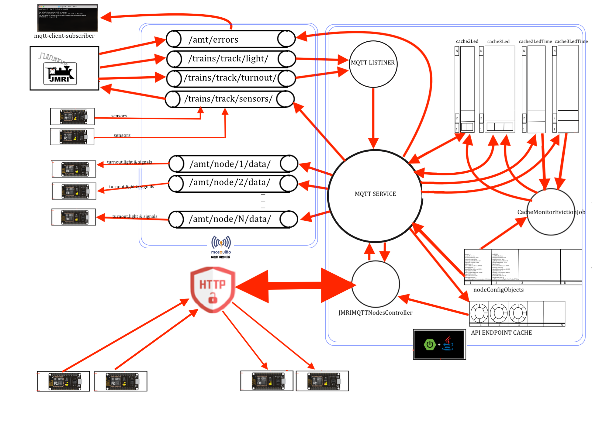

# JMRI MQTT DATA TRANSFORMER NODE SELECTOR APPLICATION

> Jmri will push the data to the mqtt  \
> transformer application configured with nodes and its details like no of turnout, no of signals, no of light in the node \
> transformer application will read the data from mqtt topics which is pushed by jmri and transform that data \
> and push back to the mqtt node wise, also store in end points cache if enabled for serving data via rest endpoints   
> topics for each esp8266 node will have only relevant data only \
> this will reduce the processing on the esp8266 so that it can handle node specific data properly.

----



### To build this application

* $ mnvn clean package

### To Run this application

* $ mvn spring-boot:run

### To Run Executable jar of application with default configuration with default profile

* $ java -jar spring-jmri-mqtt-data-transformer.jar

### To pass the customized configuration file

> for production profile with external configuration file passed from cmd line \
> NOTE COPY THE application.yaml and application.properties file from doc directory of this application \
> in the same directory where jar file is present then execute the below cmd

* java -jar -Dspring.profiles.active=prod spring-jmri-mqtt-data-transformer.jar --spring.config.name=application
* or
* java -jar -Dspring.profiles.active=prod spring-jmri-mqtt-data-transformer.jar --spring.config.location=./

### TO ACCESS THE MQTT DATA VIA END POINTS

> NOTE: IF RESULT IS 0:0000:00:00:00 THAT MEAN NODE IS NOT ENABLED FOR APIS \
> curl -X GET http://localhost:8090/amt/node/[nodeId]

* curl -X GET http://localhost:8090/amt/node/1

### TO POST THE SENSOR INFO TO  MQTT  VIA END POINTS

> curl --header "Content-Type: application/json" \
> --request POST --data '{"topic":"xyz","data":"xyz"}' \
> http://localhost:8090/amt/node/[nodeId]

* curl --header "Content-Type: application/json" \
  --request POST \
  --data '{"topic":"/trains/track/sensor/1","data":"INACTIVE"}' \
  http://localhost:8090/amt/node/1

* curl --header "Content-Type: application/json" \
  --request POST \
  --data '{"topic":"/trains/track/sensor/1","data":"ACTIVE"}' \
  http://localhost:8090/amt/node/1

### TO CONFIGURE THE MQTT FOR THE APPLICATION

```
# Custom property mqtt configuration
mqtt-properties:
  host: tcp://localhost:1883                        #mqtt host and port 
  clientId: adarsh-model-trains-transformer-        #client id for the application for mqtt 
  username: adarsh                                  #mqtt username
  password: password                                #mqtt password
  topicSub: /trains/track/#                         #mqtt jmri root topic to subscribe  
  lightTopic: /trains/track/light/                  #mqtt jmri light topic to subscribe  
  turnoutTopic: /trains/track/turnout/              #mqtt jmri turnout topic to subscribe  
  signalTopic: /trains/track/signalhead/            #mqtt jmri signalhead topic to subscribe
  cleanSession: true                                #session clearing config 
  connectionTimeout: 300                            #connection timeout config 
  keepAliveInterval: 60                             #connection keepalive config 
  automaticReconnect: true                          #connection automatic reconnected when disconnected if true 

```

## TO CONFIGURING THE NODES DATA ON APPLICATION

> CONFIGURE THE VALUES in  src/main/resources/application.yaml

```
node:
  configurations:
    lightStartingAddress: 10000                     #starting address of the light in whole layout its mandatory value 
    signal2LStartingAddress: 20000                  #starting address of the 2 light signal in whole layout its mandatory value 
    signal3LStartingAddress: 30000                  #starting address of the 3 light signal in whole layout its mandatory value     
    turnoutServoStartingAddress: 40000              #starting address of the turnout in whole layout its mandatory value
    turnoutSnapStartingAddress: 50000               #starting address of the turnout in whole layout its mandatory value
    signalCacheClearingTime: 8000                   #after every 5 sec job will clean the cache if its not updated for last 8 sec and if any stale data in cache for specific node
      
    nodes:
      -
        nodeId: 1                                   # node id/name publish topic will be formed with this id only
        enableNode: true                            # enable the node to processing for jmri data
        enablePublishing: true                      # enable the node to publishing process data to the mqtt topic
        enableRestApi: false                        # to enable the rest service for the node
        apiEndpointCacheSize: 10                    # cache for rest api to hold the data for service call        
        nodeSubscriptionTopic: /amt/node/1/data/    # topic for every node for reading data from spring transformation application                         
        turnoutBoardCount: 3                        # total number of pca9685 configured for turnouts in arduino node
        turnoutServoStartAddress: 40000             # starting address of the servo turnout in node ,if not configured then configure with 0 value 
        turnoutServoCount: 8                        # 1 pin for each servo turnout
        turnoutSnapStartAddress: 50000              # starting address of the snap relay turnout in node ,if not configured then configure with 0 value
        turnoutSnapCount: 8                         # 2 pins for each turnout on the pca9685 board (16 * 2) /16 => 16
        lightBoardCount: 6                          # total number of pca9685 configured for signal and lights in arduino node
        lightStartAddress: 1000                     # starting address of the light in node 1 ,if not configured then configure with 0 value 
        lightCount: 10                              # no of light configured in node 1 ,if not configured then configure with 0 value        
        signal2LStartAddress: 20000                 # starting address of the 2 light signal in node 1 ,if not configured then configure with 0 value
        signal2LCount: 64                           # no of signal configured in node 1 ,if not configured then configure with 0 value  
        signal3LStartAddress: 30000                 # starting address of the 3 light signal in node 1 ,if not configured then configure with 0 value 
        signal3LCount: 37                           # no of signal configured in node 1 ,if not configured then configure with 0 value  
                                                    # every light address in jmri for particular node that is the count 
                                                    # every led in signal is having one count so if 3 led in signal count is 3
                                                    # if signal is having 2 light red and green then 2 will be count for signal 
```

## samples which is configured by default

```

# Custom property for nodes configuration
node:
  configurations:
    lightStartingAddress: 10000                   #starting address of the light in whole layout its mandatory value
    signal2LStartingAddress: 20000                #starting address of the 2 light signal in whole layout its mandatory value
    signal3LStartingAddress: 30000                #starting address of the 3 light signal in whole layout its mandatory value
    turnoutServoStartingAddress: 40000            #starting address of the turnout in whole layout its mandatory value
    turnoutSnapStartingAddress: 50000             #starting address of the turnout in whole layout its mandatory value
    signalCacheClearingTime: 8000                 # after every 5 sec job will clean the cache if its not updated for last 8 sec and if any stale data in cache for specific node
    nodes:
      -
        nodeId: 1                                 # node id/name publish topic will be formed with this id only
        enableNode: true                          # enable the node to process for jmri data
        enablePublishing: true                    # enable the node to publish process data to the mqtt topic
        enableRestApi: false                      # to enable the rest service for the node
        apiEndpointCacheSize: 10                  # cache for rest api to hold the data for service call
        lightStartAddress: 10000
        lightCount: 2                             # 1 pin for each light on the pca9685 board
        signal2LStartAddress: 20000
        signal2LCount: 16                         # 2 pins for each signal light on the pca9685 board  total 16 turnout and every turnout has 2 splitter track (16 * 2 * 2) => 64
        signal3LStartAddress: 30000
        signal3LCount: 5                          # 3 pins for each signal on the pca9685 board  (10 * 3) => 30
        turnoutServoStartAddress: 40000
        turnoutServoCount: 8                      # 1 pin for each servo turnout
        turnoutSnapStartAddress: 50000
        turnoutSnapCount: 8                       # 2 pins for each turnout on the pca9685 board (16 * 2) /16 => 16
        turnoutBoardCount: 2                      # (turnoutCount * 2)/16 :=>  (16 * 2) / 16 => 2
        lightBoardCount: 2                        # (lightCount + signal2LCount + signal3LCount) /16 :=>  (5+32+30)/16 =>  5
        nodeSubscriptionTopic: /amt/node/1/data/  # topic for every node for reading data from spring transformation application

      -
        nodeId: 2
        enableNode: true
        enablePublishing: true
        enableRestApi: false
        lightStartAddress: 10100
        lightCount: 5
        signal2LStartAddress: 20100
        signal2LCount: 60
        signal3LStartAddress: 30100
        signal3LCount: 30
        turnoutServoStartAddress: 40100
        turnoutServoCount: 8
        turnoutSnapStartAddress: 50100
        turnoutSnapCount: 8
        turnoutBoardCount: 2
        lightBoardCount: 7
        nodeSubscriptionTopic: /amt/node/2/data/
        apiEndpointCacheSize: 10
      -
        nodeId: 3
        enableNode: true
        enablePublishing: true
        enableRestApi: false
        lightStartAddress: 1200
        lightCount: 7
        signal2LStartAddress: 20200
        signal2LCount: 60
        signal3LStartAddress: 30200
        signal3LCount: 18
        turnoutServoStartAddress: 40200
        turnoutServoCount: 16
        turnoutSnapStartAddress: 50200
        turnoutSnapCount: 10
        turnoutBoardCount: 3
        lightBoardCount: 6
        nodeSubscriptionTopic: /amt/node/3/data/
        apiEndpointCacheSize: 10
      -
        nodeId: 4
        enableNode: true
        enablePublishing: true
        enableRestApi: false
        lightStartAddress: 1300
        lightCount: 23
        signal2LStartAddress: 20300
        signal2LCount: 10
        signal3LStartAddress: 30300
        signal3LCount: 24
        turnoutServoStartAddress: 40300
        turnoutServoCount: 20
        turnoutSnapStartAddress: 50300
        turnoutSnapCount: 10
        turnoutBoardCount: 4
        lightBoardCount: 3
        nodeSubscriptionTopic: /amt/node/4/data/
        apiEndpointCacheSize: 10
      -
        nodeId: 5
        enableNode: true
        enablePublishing: true
        enableRestApi: false
        lightStartAddress: 1400
        lightCount: 45
        signal2LStartAddress: 20400
        signal2LCount: 10
        signal3LStartAddress: 30400
        signal3LCount: 80
        turnoutServoStartAddress: 40400
        turnoutServoCount: 20
        turnoutSnapStartAddress: 50400
        turnoutSnapCount: 12
        turnoutBoardCount: 4
        lightBoardCount: 8
        nodeSubscriptionTopic: /amt/node/5/data/
        apiEndpointCacheSize: 10
      -
        nodeId: 6
        enableNode: true
        enablePublishing: true
        enableRestApi: false
        lightStartAddress: 1500
        lightCount: 10
        signal2LStartAddress: 20500
        signal2LCount: 10
        signal3LStartAddress: 30500
        signal3LCount: 45
        turnoutServoStartAddress: 40500
        turnoutServoCount: 20
        turnoutSnapStartAddress: 50500
        turnoutSnapCount: 18
        turnoutBoardCount: 5
        lightBoardCount: 4
        nodeSubscriptionTopic: /amt/node/6/data/
        apiEndpointCacheSize: 10
      -
        nodeId: 7
        enableNode: true
        enablePublishing: true
        enableRestApi: false
        lightStartAddress: 1600
        lightCount: 12
        signal2LStartAddress: 20600
        signal2LCount: 10
        signal3LStartAddress: 30600
        signal3LCount: 80
        turnoutServoStartAddress: 40600
        turnoutServoCount: 29
        turnoutSnapStartAddress: 50600
        turnoutSnapCount: 16
        turnoutBoardCount: 4
        lightBoardCount: 6
        nodeSubscriptionTopic: /amt/node/7/data/
        apiEndpointCacheSize: 10
      -
        nodeId: 8
        enableNode: true
        enablePublishing: true
        enableRestApi: false
        lightStartAddress: 1700
        lightCount: 7
        signal2LStartAddress: 20700
        signal2LCount: 10
        signal3LStartAddress: 30700
        signal3LCount: 87
        turnoutServoStartAddress: 40700
        turnoutServoCount: 32
        turnoutSnapStartAddress: 50700
        turnoutSnapCount: 16
        turnoutBoardCount: 4
        lightBoardCount: 6
        nodeSubscriptionTopic: /amt/node/8/data/
        apiEndpointCacheSize: 10
      -
        nodeId: 9
        enableNode: true
        enablePublishing: true
        enableRestApi: false
        lightStartAddress: 1800
        lightCount: 23
        signal2LStartAddress: 20800
        signal2LCount: 10
        signal3LStartAddress: 30800
        signal3LCount: 24
        turnoutServoStartAddress: 40800
        turnoutServoCount: 32
        turnoutSnapStartAddress: 50800
        turnoutSnapCount: 16
        turnoutBoardCount: 4
        lightBoardCount: 3
        nodeSubscriptionTopic: /amt/node/9/data/
        apiEndpointCacheSize: 10
      -
        nodeId: 10
        enableNode: true
        enablePublishing: true
        enableRestApi: false
        lightStartAddress: 1900
        lightCount: 45
        signal2LStartAddress: 20900
        signal2LCount: 10
        signal3LStartAddress: 30900
        signal3LCount: 80
        turnoutServoStartAddress: 40800
        turnoutServoCount: 32
        turnoutSnapStartAddress: 50800
        turnoutSnapCount: 16
        turnoutBoardCount: 4
        lightBoardCount: 8
        nodeSubscriptionTopic: /amt/node/10/data/
        apiEndpointCacheSize: 10
```

### TO GET CONFIGURATION FROM REST ENDPOINTS

> this will give each and every detail about the nodes and its component like light signal and turnouts
> and how to configure it in jmri which what address for each in details  
> and how to configure the signals turnout and light in pca9685
> details about the board and pin and component mapping to that
* curl -X GET http://localhost:8090/amt/description/node
* http://localhost:8090/amt/description/node
```
[
  {
    "nodeId": "1",
    "enableNode": true,
    "enablePublishing": true,
    "enableRestApi": false,
    "lightStartAddress": 10000,
    "lightCount": 2,
    "signal2LStartAddress": 20000,
    "signal2LCount": 8,
    "signal3LStartAddress": 30000,
    "signal3LCount": 5,
    "turnoutServoStartAddress": 40000,
    "turnoutServoCount": 8,
    "turnoutSnapStartAddress": 50000,
    "turnoutSnapCount": 8,
    "turnoutBoardCount": 2,
    "lightBoardCount": 2,
    "nodeSubscriptionTopic": "/amt/node/1/data/",
    "apiEndpointCacheSize": 10,
    "totalLightPins": 2,
    "totalSignal2LedPins": 16,
    "totalSignal3LedPins": 15,
    "totalServoTurnoutPins": 8,
    "totalSnapTurnoutPins": 16,
    "totalBoardRequired": " Total Servo TurnoutBoard Required is 1 Total Snap TurnoutBoard Required is 1 Total Light & Signal Boards Required is 4",
    "jmriAddressTurnoutServo": {
      " Servo Number 1": " Jmri Address 40001, BoardNo:PinNo:Status => 00:00:TH - 00:00:CL",
      " Servo Number 2": " Jmri Address 40002, BoardNo:PinNo:Status => 00:01:TH - 00:01:CL",
      " Servo Number 3": " Jmri Address 40003, BoardNo:PinNo:Status => 00:02:TH - 00:02:CL",
      " Servo Number 4": " Jmri Address 40004, BoardNo:PinNo:Status => 00:03:TH - 00:03:CL",
      " Servo Number 5": " Jmri Address 40005, BoardNo:PinNo:Status => 00:04:TH - 00:04:CL",
      " Servo Number 6": " Jmri Address 40006, BoardNo:PinNo:Status => 00:05:TH - 00:05:CL",
      " Servo Number 7": " Jmri Address 40007, BoardNo:PinNo:Status => 00:06:TH - 00:06:CL",
      " Servo Number 8": " Jmri Address 40008, BoardNo:PinNo:Status => 00:07:TH - 00:07:CL"
    },
    "jmriAddressTurnoutSnap": {
      " Snap Number 1": " Jmri Address 50001, BoardNo:PinNo:Status => 01:00:TH - 01:01:CL",
      " Snap Number 2": " Jmri Address 50002, BoardNo:PinNo:Status => 01:02:TH - 01:03:CL",
      " Snap Number 3": " Jmri Address 50003, BoardNo:PinNo:Status => 01:04:TH - 01:05:CL",
      " Snap Number 4": " Jmri Address 50004, BoardNo:PinNo:Status => 01:06:TH - 01:07:CL",
      " Snap Number 5": " Jmri Address 50005, BoardNo:PinNo:Status => 01:08:TH - 01:09:CL",
      " Snap Number 6": " Jmri Address 50006, BoardNo:PinNo:Status => 01:10:TH - 01:11:CL",
      " Snap Number 7": " Jmri Address 50007, BoardNo:PinNo:Status => 01:12:TH - 01:13:CL",
      " Snap Number 8": " Jmri Address 50008, BoardNo:PinNo:Status => 01:14:TH - 01:15:CL"
    },
    "jmriAddressLight": {
      " Light Number 1": "Jmri Address 10001, BoardNo:PinNo:Status => 02:00:ON - 02:00:OF",
      " Light Number 2": "Jmri Address 10002, BoardNo:PinNo:Status => 02:01:ON - 02:01:OF"
    },
    "jmriAddressSignal2Led": {
      "RED   2Led Signal Number 1": " Jmri Address 20001, BoardNo:PinNo:Status => 02:02:ON - 02:02:OF",
      "GREEN 2Led Signal Number 1": " Jmri Address 20002, BoardNo:PinNo:Status => 02:03:ON - 02:03:OF",
      "RED   2Led Signal Number 2": " Jmri Address 20003, BoardNo:PinNo:Status => 02:04:ON - 02:04:OF",
      "GREEN 2Led Signal Number 2": " Jmri Address 20004, BoardNo:PinNo:Status => 02:05:ON - 02:05:OF",
      "RED   2Led Signal Number 3": " Jmri Address 20005, BoardNo:PinNo:Status => 02:06:ON - 02:06:OF",
      "GREEN 2Led Signal Number 3": " Jmri Address 20006, BoardNo:PinNo:Status => 02:07:ON - 02:07:OF",
      "RED   2Led Signal Number 4": " Jmri Address 20007, BoardNo:PinNo:Status => 02:08:ON - 02:08:OF",
      "GREEN 2Led Signal Number 4": " Jmri Address 20008, BoardNo:PinNo:Status => 02:09:ON - 02:09:OF",
      "RED   2Led Signal Number 5": " Jmri Address 20009, BoardNo:PinNo:Status => 02:10:ON - 02:10:OF",
      "GREEN 2Led Signal Number 5": " Jmri Address 20010, BoardNo:PinNo:Status => 02:11:ON - 02:11:OF",
      "RED   2Led Signal Number 6": " Jmri Address 20011, BoardNo:PinNo:Status => 02:12:ON - 02:12:OF",
      "GREEN 2Led Signal Number 6": " Jmri Address 20012, BoardNo:PinNo:Status => 02:13:ON - 02:13:OF",
      "RED   2Led Signal Number 7": " Jmri Address 20013, BoardNo:PinNo:Status => 02:14:ON - 02:14:OF",
      "GREEN 2Led Signal Number 7": " Jmri Address 20014, BoardNo:PinNo:Status => 02:15:ON - 02:15:OF",
      "RED   2Led Signal Number 8": " Jmri Address 20015, BoardNo:PinNo:Status => 03:00:ON - 03:00:OF",
      "GREEN 2Led Signal Number 8": " Jmri Address 20016, BoardNo:PinNo:Status => 03:01:ON - 03:01:OF"
    },
    "jmriAddressSignal3Led": {
      "RED    3Led Signal Number 1": " Jmri Address 30001, BoardNo:PinNo:Status => 03:02:ON - 03:02:OF",
      "GREEN  3Led Signal Number 1": " Jmri Address 30002, BoardNo:PinNo:Status => 03:03:ON - 03:03:OF",
      "YELLOW 3Led Signal Number 1": " Jmri Address 30003, BoardNo:PinNo:Status => 03:04:ON - 03:04:OF",
      "RED    3Led Signal Number 2": " Jmri Address 30004, BoardNo:PinNo:Status => 03:05:ON - 03:05:OF",
      "GREEN  3Led Signal Number 2": " Jmri Address 30005, BoardNo:PinNo:Status => 03:06:ON - 03:06:OF",
      "YELLOW 3Led Signal Number 2": " Jmri Address 30006, BoardNo:PinNo:Status => 03:07:ON - 03:07:OF",
      "RED    3Led Signal Number 3": " Jmri Address 30007, BoardNo:PinNo:Status => 03:08:ON - 03:08:OF",
      "GREEN  3Led Signal Number 3": " Jmri Address 30008, BoardNo:PinNo:Status => 03:09:ON - 03:09:OF",
      "YELLOW 3Led Signal Number 3": " Jmri Address 30009, BoardNo:PinNo:Status => 03:10:ON - 03:10:OF",
      "RED    3Led Signal Number 4": " Jmri Address 30010, BoardNo:PinNo:Status => 03:11:ON - 03:11:OF",
      "GREEN  3Led Signal Number 4": " Jmri Address 30011, BoardNo:PinNo:Status => 03:12:ON - 03:12:OF",
      "YELLOW 3Led Signal Number 4": " Jmri Address 30012, BoardNo:PinNo:Status => 03:13:ON - 03:13:OF",
      "RED    3Led Signal Number 5": " Jmri Address 30013, BoardNo:PinNo:Status => 03:14:ON - 03:14:OF",
      "GREEN  3Led Signal Number 5": " Jmri Address 30014, BoardNo:PinNo:Status => 03:15:ON - 03:15:OF",
      "YELLOW 3Led Signal Number 5": " Jmri Address 30015, BoardNo:PinNo:Status => 04:00:ON - 04:00:OF"
    }
  }
  ,{
      .....................  
  }
  ,{
      .....................  
  }
  
]
```
### To fetch for a particular node 
* curl -X GET http://localhost:8090/amt/description/node/[nodeId]
* http://localhost:8090/amt/description/node/[nodeId]
* http://localhost:8090/amt/description/node/1
```
$ curl -X GET http://localhost:8090/amt/description/node/1

[
  {
    "nodeId": "1",
    "enableNode": true,
    "enablePublishing": true,
    "enableRestApi": false,
    "lightStartAddress": 10000,
    "lightCount": 2,
    "signal2LStartAddress": 20000,
    "signal2LCount": 8,
    "signal3LStartAddress": 30000,
    "signal3LCount": 5,
    "turnoutServoStartAddress": 40000,
    "turnoutServoCount": 8,
    "turnoutSnapStartAddress": 50000,
    "turnoutSnapCount": 8,
    "turnoutBoardCount": 2,
    "lightBoardCount": 2,
    "nodeSubscriptionTopic": "/amt/node/1/data/",
    "apiEndpointCacheSize": 10,
    "totalLightPins": 2,
    "totalSignal2LedPins": 16,
    "totalSignal3LedPins": 15,
    "totalServoTurnoutPins": 8,
    "totalSnapTurnoutPins": 16,
    "totalBoardRequired": " Total Servo TurnoutBoard Required is 1 Total Snap TurnoutBoard Required is 1 Total Light & Signal Boards Required is 4",
    "jmriAddressTurnoutServo": {
      " Servo Number 1": " Jmri Address 40001, BoardNo:PinNo:Status => 00:00:TH - 00:00:CL",
      " Servo Number 2": " Jmri Address 40002, BoardNo:PinNo:Status => 00:01:TH - 00:01:CL",
      " Servo Number 3": " Jmri Address 40003, BoardNo:PinNo:Status => 00:02:TH - 00:02:CL",
      " Servo Number 4": " Jmri Address 40004, BoardNo:PinNo:Status => 00:03:TH - 00:03:CL",
      " Servo Number 5": " Jmri Address 40005, BoardNo:PinNo:Status => 00:04:TH - 00:04:CL",
      " Servo Number 6": " Jmri Address 40006, BoardNo:PinNo:Status => 00:05:TH - 00:05:CL",
      " Servo Number 7": " Jmri Address 40007, BoardNo:PinNo:Status => 00:06:TH - 00:06:CL",
      " Servo Number 8": " Jmri Address 40008, BoardNo:PinNo:Status => 00:07:TH - 00:07:CL"
    },
    "jmriAddressTurnoutSnap": {
      " Snap Number 1": " Jmri Address 50001, BoardNo:PinNo:Status => 01:00:TH - 01:01:CL",
      " Snap Number 2": " Jmri Address 50002, BoardNo:PinNo:Status => 01:02:TH - 01:03:CL",
      " Snap Number 3": " Jmri Address 50003, BoardNo:PinNo:Status => 01:04:TH - 01:05:CL",
      " Snap Number 4": " Jmri Address 50004, BoardNo:PinNo:Status => 01:06:TH - 01:07:CL",
      " Snap Number 5": " Jmri Address 50005, BoardNo:PinNo:Status => 01:08:TH - 01:09:CL",
      " Snap Number 6": " Jmri Address 50006, BoardNo:PinNo:Status => 01:10:TH - 01:11:CL",
      " Snap Number 7": " Jmri Address 50007, BoardNo:PinNo:Status => 01:12:TH - 01:13:CL",
      " Snap Number 8": " Jmri Address 50008, BoardNo:PinNo:Status => 01:14:TH - 01:15:CL"
    },
    "jmriAddressLight": {
      " Light Number 1": "Jmri Address 10001, BoardNo:PinNo:Status => 02:00:ON - 02:00:OF",
      " Light Number 2": "Jmri Address 10002, BoardNo:PinNo:Status => 02:01:ON - 02:01:OF"
    },
    "jmriAddressSignal2Led": {
      "RED   2Led Signal Number 1": " Jmri Address 20001, BoardNo:PinNo:Status => 02:02:ON - 02:02:OF",
      "GREEN 2Led Signal Number 1": " Jmri Address 20002, BoardNo:PinNo:Status => 02:03:ON - 02:03:OF",
      "RED   2Led Signal Number 2": " Jmri Address 20003, BoardNo:PinNo:Status => 02:04:ON - 02:04:OF",
      "GREEN 2Led Signal Number 2": " Jmri Address 20004, BoardNo:PinNo:Status => 02:05:ON - 02:05:OF",
      "RED   2Led Signal Number 3": " Jmri Address 20005, BoardNo:PinNo:Status => 02:06:ON - 02:06:OF",
      "GREEN 2Led Signal Number 3": " Jmri Address 20006, BoardNo:PinNo:Status => 02:07:ON - 02:07:OF",
      "RED   2Led Signal Number 4": " Jmri Address 20007, BoardNo:PinNo:Status => 02:08:ON - 02:08:OF",
      "GREEN 2Led Signal Number 4": " Jmri Address 20008, BoardNo:PinNo:Status => 02:09:ON - 02:09:OF",
      "RED   2Led Signal Number 5": " Jmri Address 20009, BoardNo:PinNo:Status => 02:10:ON - 02:10:OF",
      "GREEN 2Led Signal Number 5": " Jmri Address 20010, BoardNo:PinNo:Status => 02:11:ON - 02:11:OF",
      "RED   2Led Signal Number 6": " Jmri Address 20011, BoardNo:PinNo:Status => 02:12:ON - 02:12:OF",
      "GREEN 2Led Signal Number 6": " Jmri Address 20012, BoardNo:PinNo:Status => 02:13:ON - 02:13:OF",
      "RED   2Led Signal Number 7": " Jmri Address 20013, BoardNo:PinNo:Status => 02:14:ON - 02:14:OF",
      "GREEN 2Led Signal Number 7": " Jmri Address 20014, BoardNo:PinNo:Status => 02:15:ON - 02:15:OF",
      "RED   2Led Signal Number 8": " Jmri Address 20015, BoardNo:PinNo:Status => 03:00:ON - 03:00:OF",
      "GREEN 2Led Signal Number 8": " Jmri Address 20016, BoardNo:PinNo:Status => 03:01:ON - 03:01:OF"
    },
    "jmriAddressSignal3Led": {
      "RED    3Led Signal Number 1": " Jmri Address 30001, BoardNo:PinNo:Status => 03:02:ON - 03:02:OF",
      "GREEN  3Led Signal Number 1": " Jmri Address 30002, BoardNo:PinNo:Status => 03:03:ON - 03:03:OF",
      "YELLOW 3Led Signal Number 1": " Jmri Address 30003, BoardNo:PinNo:Status => 03:04:ON - 03:04:OF",
      "RED    3Led Signal Number 2": " Jmri Address 30004, BoardNo:PinNo:Status => 03:05:ON - 03:05:OF",
      "GREEN  3Led Signal Number 2": " Jmri Address 30005, BoardNo:PinNo:Status => 03:06:ON - 03:06:OF",
      "YELLOW 3Led Signal Number 2": " Jmri Address 30006, BoardNo:PinNo:Status => 03:07:ON - 03:07:OF",
      "RED    3Led Signal Number 3": " Jmri Address 30007, BoardNo:PinNo:Status => 03:08:ON - 03:08:OF",
      "GREEN  3Led Signal Number 3": " Jmri Address 30008, BoardNo:PinNo:Status => 03:09:ON - 03:09:OF",
      "YELLOW 3Led Signal Number 3": " Jmri Address 30009, BoardNo:PinNo:Status => 03:10:ON - 03:10:OF",
      "RED    3Led Signal Number 4": " Jmri Address 30010, BoardNo:PinNo:Status => 03:11:ON - 03:11:OF",
      "GREEN  3Led Signal Number 4": " Jmri Address 30011, BoardNo:PinNo:Status => 03:12:ON - 03:12:OF",
      "YELLOW 3Led Signal Number 4": " Jmri Address 30012, BoardNo:PinNo:Status => 03:13:ON - 03:13:OF",
      "RED    3Led Signal Number 5": " Jmri Address 30013, BoardNo:PinNo:Status => 03:14:ON - 03:14:OF",
      "GREEN  3Led Signal Number 5": " Jmri Address 30014, BoardNo:PinNo:Status => 03:15:ON - 03:15:OF",
      "YELLOW 3Led Signal Number 5": " Jmri Address 30015, BoardNo:PinNo:Status => 04:00:ON - 04:00:OF"
    }
  }
]
```

### To subscribe the mqtt jmri topic with original jmri messages

* $ mosquitto_sub -h localhost -u adarsh -P password -v -t '/trains/track/#'

### To subscribe the mqtt application error topic

* $ mosquitto_sub -h localhost -u adarsh -P password -v -t '/amt/errors/#'

### To subscribe the mqtt topic where application will publish data after transformation

* $ mosquitto_sub -h localhost -u adarsh -P password -v -t '/amt/node/#'

```
/amt/node/1/data/ T:40001:00:00:CL
/amt/node/1/data/ T:40001:00:00:TH
/amt/node/1/data/ T:40008:00:07:CL
/amt/node/1/data/ T:40008:00:07:TH

/amt/node/1/data/ T:50001:01:01:CL
/amt/node/1/data/ T:50001:01:00:TH
/amt/node/1/data/ T:50008:01:15:CL
/amt/node/1/data/ T:50008:01:14:TH

/amt/node/1/data/ L:10001:02:00:ON
/amt/node/1/data/ L:10001:02:00:OF
/amt/node/1/data/ L:10002:02:01:ON
/amt/node/1/data/ L:10002:02:01:OF

/amt/node/1/data/ S:20002:02:03:ON|20001:02:02:OF
/amt/node/1/data/ S:20002:02:03:ON|20001:02:02:ON
/amt/node/1/data/ S:20002:02:03:OF|20001:02:02:ON
/amt/node/1/data/ S:20002:02:03:OF|20001:02:02:OF
/amt/node/1/data/ S:20016:03:01:ON|20015:03:00:OF
/amt/node/1/data/ S:20016:03:01:ON|20015:03:00:ON
/amt/node/1/data/ S:20016:03:01:OF|20015:03:00:ON
/amt/node/1/data/ S:20016:03:01:OF|20015:03:00:OF

/amt/node/1/signal/ S:30003:03:02:ON|30002:03:01:OF|30001:03:00:OF
/amt/node/1/signal/ S:30003:03:02:OF|30002:03:01:ON|30001:03:00:OF
/amt/node/1/signal/ S:30003:03:02:OF|30002:03:01:OF|30001:03:00:ON
/amt/node/1/signal/ S:30003:03:02:OF|30002:03:01:OF|30001:03:00:OF

```


